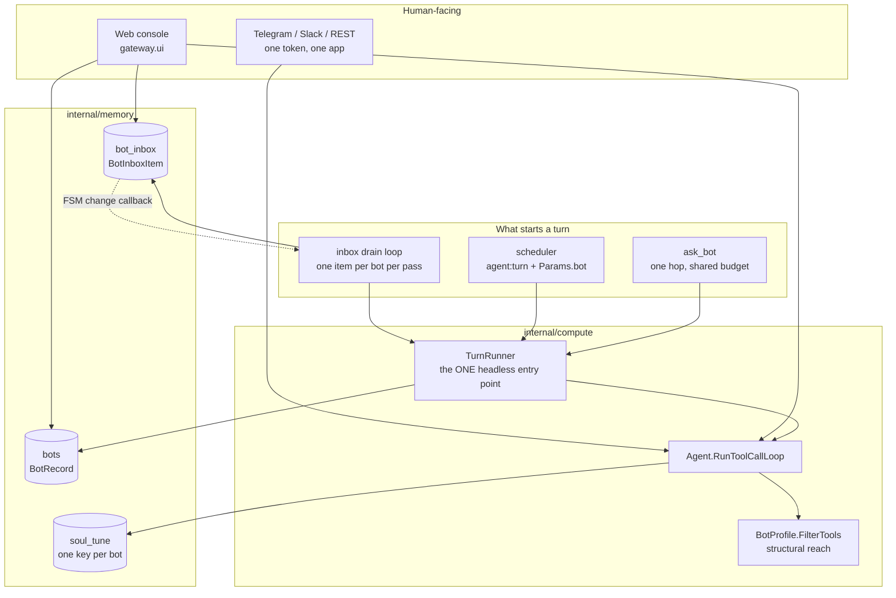
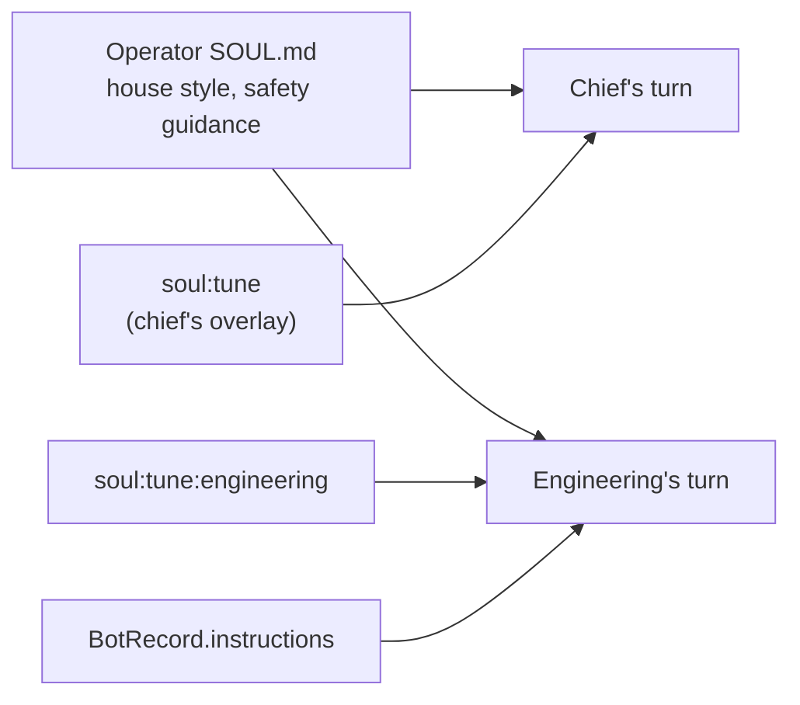
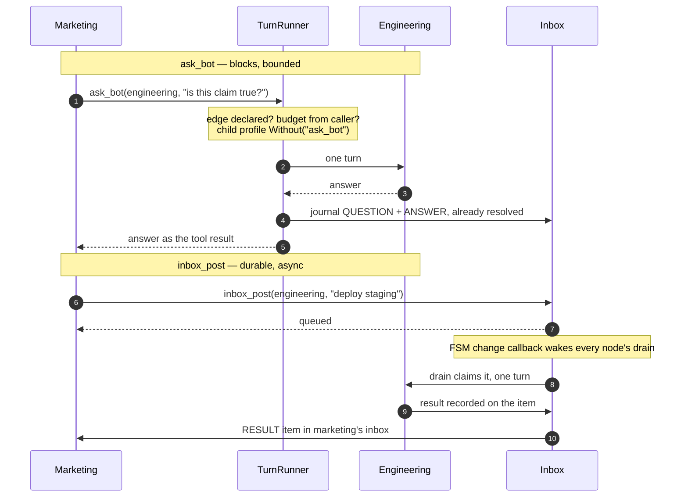

# Bots — a team, not an assistant

How lobslaw went from one agent to several, and why each piece is
shaped the way it is.

## TL;DR

A **bot is a principal**. Everything that already decides against a
principal — memory ownership, policy subjects, scheduled-task owners,
audit entries — inherits per-bot isolation for free. A bot's authority
is NOT a field on its record; it runs as `bot:<id>` and the policy
engine decides what that may do, exactly as for any other subject.

Four things follow from that, and one thing does not:

| Piece | Where | Shape |
|---|---|---|
| Registry | `internal/memory/bots.go` | Raft record, revision-checked CAS |
| Personality | `internal/soul` | One overlay per bot, chief keeps the pre-existing key |
| Turns | `internal/compute/turnrunner.go` | One runner, N callers |
| Queue | `internal/memory/bot_inbox.go` | Durable work queue, `LOG_OP_CLAIM` |

The thing that does not follow: **tool reach**. That is a registry
filter applied before the turn starts, so a tool a bot may not use is
one the model is never shown. Policy still says no; this decides what
is expressible.

---

## The shape



---

## 1 · A bot is a principal

`internal/identity` gained a third kind beside `user:` and `chat:`.

```
user:alice                 a person
chat:telegram:-1001234     a conversation, owned collectively
bot:engineering            one of the assistant's own agents
```

A bot's turn runs with `Claims{UserID: "bot:engineering", Scope:
"bot:engineering", Roles: ["bot"]}`. Because policy is default-deny, a
new bot can do **nothing** until rules exist for it — the correct
starting posture, and the reason to model authority this way rather
than as fields on a record. Two authorisation systems beside each
other is how they come to disagree.

### The defect this walked into

`Resolver.Resolve` wraps whatever it is handed in the **user** kind. A
bot turn's `"bot:engineering"` therefore became
`"user:bot:engineering"` — the same double-prefix trap `Principal.ID`
documents, reached from the other direction.

That is not cosmetic. The bot would own nothing it wrote and match no
rule written about it, and both failures present as *"the bot just
isn't working"*. A bot's principal is now **minted**, never resolved.

Explicit claims still win: a routine alice scheduled is worked by the
devops bot and attributed to alice. `turn.Identity` carries `BotID`
separately from `Principal` for exactly that case — *who is doing the
work* and *who owns it* are different questions.

---

## 2 · The registry

`BotRecord` in `bots`, keyed by an immutable slug that is also the
principal's identifier. Writes are revision-checked CAS through Raft,
mirroring `SoulTuneService`; reads are local off the FSM.

Three rules enforced on write:

- **The id is a slug.** It becomes a principal, a soul-overlay key
  suffix and a policy subject, so a colon or a space silently changes
  what a rule matches.
- **An update cannot claim the chief flag.** There is one chief, it
  owns the human-facing channels, and a second would mean two agents
  answering the same Telegram message.
- **`may_message` must stay acyclic.** See §5.

`instructions` is capped at 8 KB. It rides on every turn the bot takes,
so an unbounded brief is an unbounded per-turn tax nothing else would
report as the cause.

### The chief, and the upgrade

`EnsureChief` seeds one record at first boot, leader-gated and
idempotent. Its display name comes from the soul's `name` when it has
one — the operator already said what to call the assistant, and asking
again in a second place is how the two come to disagree.

**This is the entire upgrade story.** See §3.

---

## 3 · Personality, per bot

`SoulTuneRecordID` became a prefix. The chief's key is those exact
bytes unchanged; every other bot gets `soul:tune:<id>`.



Note what is **absent**: the chief's overlay does not sit under a
bot's. *"Be less sarcastic with me"*, said to the chief in Telegram, is
about the chief; having it silently re-tune the devops bot would be
action-at-a-distance nobody would connect back to the sentence that
caused it. A bot with no overlay of its own serves the operator's
baseline — which is right, because `SOUL.md` is the house style every
bot should share.

Both paths merge through one function (`mergeOnBaselineLocked`), so
the ±3 drift clamp cannot come to be enforced differently for a bot
than for the chief.

`soul.BotTuneStore` is an **optional** interface rather than more
methods on `TuneStore`: a store that does not implement it serves the
chief's overlay to everyone, which is what a single-assistant
deployment already has.

**Why the chief's key had to stay byte-identical:** an existing cluster
has an overlay under `soul:tune` and no bots bucket. If the chief got a
key of its own, every deployment would wake up after an upgrade with a
default personality — silent, landing on the user rather than the
operator, with no obvious connection to the upgrade. There is a test
that fails if anyone changes it.

---

## 4 · One turn-runner, N callers

R33 found three implementations of *"run an agent turn"*
(`runTaskAsAgentTurn`, `runCommitmentAsAgentTurn`, the research worker)
and named the fix as belonging in the writing rather than the
post-mortem. Bots would have made it five.

`compute.TurnRunner` is the one place a **headless** turn starts — one
with no human waiting on a channel. It owns budget derivation, profile
resolution and the turn id. Channel handlers keep their own entry
points: a session to write, a responder to drive and a confirmation to
route back are genuinely a different shape, and folding them in would
mean the runner grew all three.

`TestOnlyOneImplementationOfRunningAHeadlessTurn` walks the tree and
fails on a new direct caller, against a small annotated allowlist.
Adding to it is fine — it just has to be a decision somebody wrote
down. The failure mode it prevents is not one anybody notices: a fourth
copy works perfectly and drifts later, one forgotten budget at a time.

### Tool reach is structural

```go
// Empty allowlist means the node's FULL set, not the empty set.
profile.FilterTools(registry.LLMTools())
```

Applied in the agent's `fillDefaults`, before the list reaches
promptgen. The agent rather than the runner because it is the choke
point *every* turn passes, channels included — the console chats to a
bot through one, and a filter covering only headless turns would cover
the half that matters least.

An empty allowlist means everything, deliberately: a bot created
without anyone stating its tools should be as capable as the assistant
was before it existed. Silently muting one presents as a broken bot
rather than as a decision somebody made. Refusing everything is a
policy rule — policy is the thing that says no.

`BotProfile.Denied` is subtracted **last and unconditionally**, and
exists because one list cannot express both rules: removing the only
entry from an allowlist empties it, and an empty allowlist re-grants
the tool being taken away. That is not hypothetical — it was the first
implementation of the delegation guard.

---

## 5 · Talking to each other

Two ways, answering different questions.



### The five constraints, and which two are structural

| Constraint | How |
|---|---|
| Bounded spend | Child draws on the **caller's** budget via `TurnBudget.Sub` — structural |
| One hop | Child's profile has `ask_bot` denied — structural |
| No cycles | `may_message` validated as a DAG **on write** |
| No session interference | Child gets its own `TurnID`, returns a value |
| Fails closed | Names the bot that refused; cannot raise a confirmation |

The budget rides on the **context**, for the same reason turn identity
does: the tool-argument map is built from the model's own output, and a
model that can choose its own budget has none.

A child cannot ask for a confirmation because the person is in a
conversation with the *caller*, and R2's prompt carries `RaisedFor`
precisely so the wrong party cannot answer one. Routing a child's
prompt up to the parent's channel is a real and desirable follow-on and
is explicitly **not** in this work.

### Why the cycle check is on write

A cycle caught when the edge is proposed is one error message to one
person about a decision they just made. The same cycle caught at call
time is a depth counter, a mid-conversation refusal, and a bill for
however many turns ran before it tripped.

The path is named and **deterministic** — map iteration order in Go is
random, and an error naming a different path each run is one nobody can
act on or write a test for.

---

## 6 · The inbox

Not a delivery pipe: each bot's durable **work queue and journal**.

Sessions record what was *said*; traces record what *ran*. Neither
answers what is queued, what is stuck, or what failed. The inbox does,
and it is the same record the bot itself reasons over — so the console
and the bot can never disagree about state.

### Keying, and why status is not in the key

`<recipient>:<ulid>` — one bot's queue is an ordered prefix scan, and
arrival order is the tiebreak within a priority band.

Status is deliberately **not** in the key. Claiming is a
revision-checked CAS against one key; a status that moved the record
would make every transition a delete-and-put, which is exactly the
read-modify-write the CAS exists to make safe.

### Claiming reuses `LOG_OP_CLAIM`

The same revision-plus-claimer CAS the scheduler uses. Two claim
mechanisms is how they come to disagree, and this one would disagree
about exactly-once.

Expiry is checked **outside** the FSM for the reason dueness is: it
reads a clock, and the FSM must produce the same result on every
replica and on every replay.

### The drain is a loop, not a scheduled task

The first implementation *was* a scheduled task, and it did not work.
The FSM wake fires the moment an item lands, but a cron task only fires
on its schedule — so an item posted at :10 sat until the next minute.

Exactly-once is already guaranteed one level down by the per-item CAS,
so **every node runs the loop** and that is throughput rather than a
race. An item is now worked in about a second. The integration test
caught this; the comment claiming otherwise did not.

One item per bot per pass, not the whole queue: it keeps a failure's
blast radius to one task, gives every item its own session for the
console to deep-link to, and re-evaluates priority between items.
Completing an item is itself an inbox write, so the wake it fires
brings the loop straight back and a backlog still clears promptly.

### Nothing evaporates

A failure with attempts left returns to `PENDING`. Out of attempts it
becomes `FAILED`, **visible**, with the reason on the record. A bot
that no longer exists fails immediately rather than burning a provider
call per pass forever against a queue nobody is coming back to.

### Bounds are load-bearing

Every queued item is replicated on every voter.

- Per-**recipient** pending cap (default 200), failing to the
  **sender**. A runaway producer should stall the bot it is flooding,
  not the cluster — and a post that vanished silently would be the
  exact failure the queue exists to prevent.
- 30-day retention on **terminal** items only. Pending and claimed
  items are never pruned however old: an item nobody worked is a
  problem to surface, not one to tidy away.

---

## 7 · Reaching you

One Telegram token, one Slack app. A bot's message is relayed through
the chief's identity with a sender label, stamped from turn identity
and **never** from a tool argument — a bot that could name its own
sender could send you something that looks like it came from another.

The trade: every bot shares an avatar. What it buys: a new bot works
the moment it is created, with no token to provision, which is what
makes "make me a devops bot" a sentence rather than a project.

Routine output goes to the **inbox** rather than to `notify`, so a
daily cluster check accumulates a readable history instead of a stream
of pings, and `notify` stays reserved for things that need you now.

---

## 8 · Web console

React 19 + Chakra UI v3, built by Vite straight into
`internal/gateway/ui/dist` and `go:embed`'d. Served by the gateway's
own listener — one binary, one port, no CORS, and no way for a front
end and an API to drift apart in version.

Off by default, and **enabling it on a non-loopback bind refuses to
start without `[auth] require_auth`**. `require_auth` defaults false
because that is right for an API behind a reverse proxy; it is not
right for a console that can rewrite instructions, read every
conversation and assign the team work. A refusal rather than a warning:
a warning at boot is a line in a log nobody reads until afterwards, and
the failure it precedes is somebody else's browser.

Loopback is exempt, which is why `[gateway] bind_address` now exists —
the listener could only bind every interface, so "reachable from this
machine only" was not expressible, and without the exemption an
operator wanting the console on their laptop would have to stand up a
JWT issuer.

`make web` is **not** a prerequisite of `make build`. The embed
directory keeps a committed `.gitkeep` and Vite is told not to empty
it: without that a clean checkout has no `dist/` at all, which makes
`go:embed` a *compile* error for anyone who has not run the web build.

---

## Deliberate limits

- **No per-bot channel identity.** One token, attribution in the body.
  Revisit when somebody wants a bot with its own Slack avatar enough to
  provision a token per bot.
- **No confirmation routing from a child to the caller's channel.**
  Designed, desirable, deliberately out of scope — R31's sharpest bug
  was in exactly that machinery.
- **No per-bot notification rate limiting.** Routing routine output to
  the inbox is the mitigation; revisit the first time somebody mutes
  the chief.
- **No per-bot chat threads in the console.** That needs a session
  dimension the transcript store does not have, and inventing one in
  the browser would produce a history the node does not agree with.
