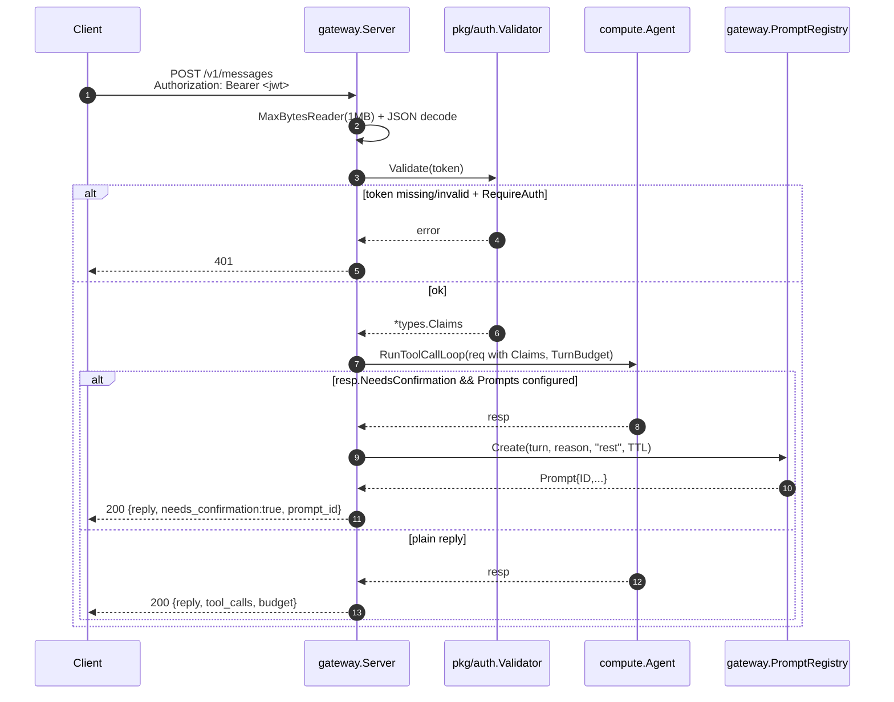
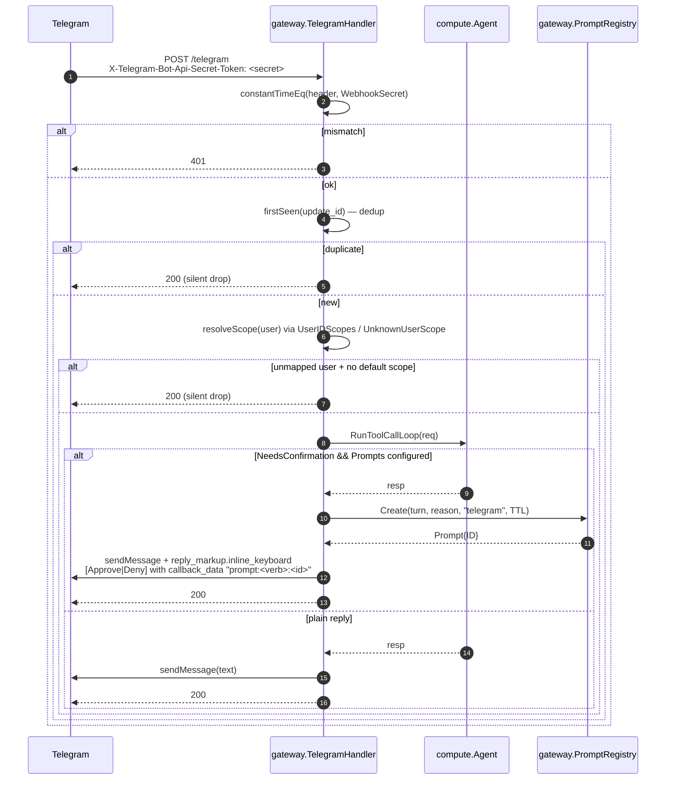
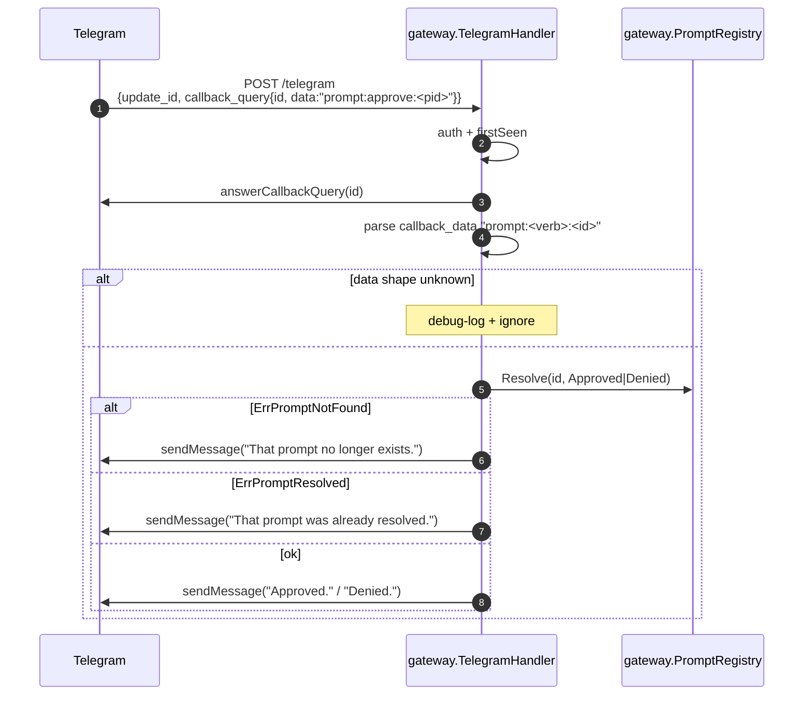

# lobslaw — Gateway (channels)

The gateway is the user-facing edge. It turns inbound REST / Telegram traffic into `compute.ProcessMessageRequest` calls on the agent loop, then turns the agent's response back into a channel-appropriate reply (JSON, or a Telegram message with inline buttons).

Three packages cooperate:

- `internal/gateway` — the REST server (`Server`), the Telegram webhook handler (`TelegramHandler`), and the confirmation registry both channels share (`Prompts`, with an in-memory and a raft-backed implementation).
- `pkg/auth` — JWT validation (`Validator`, `ExtractBearer`) used by the REST server to authenticate inbound requests.
- `internal/compute` — the agent loop, tool registry, executor, budget, and mock/real LLM providers the channels drive.

The agent loop knows nothing about HTTP or Telegram. Each channel is a thin adapter that translates inbound transport into an internal request.

---

## Request flow — REST



Client then polls `GET /v1/prompts/<id>` for state and confirms via `POST /v1/prompts/<id>/resolve` with `{"approve": bool}`.

### Routes

| Method + Path | Purpose | Status codes |
|---|---|---|
| `POST /v1/messages` | Main user entry — sends a message to the agent | 200, 400, 401 (w/ RequireAuth), 500, 503 (no agent) |
| `GET  /healthz` | Liveness — process alive | 200 |
| `GET  /readyz` | Readiness — server bound + agent configured | 200, 503 |
| `GET  /v1/prompts/<id>` | Fetch prompt state | 200, 404 |
| `POST /v1/prompts/<id>/resolve` | Approve/deny a confirmation | 200, 400, 404, 409 (already resolved) |
| `POST /telegram` | Telegram webhook (if `Telegram` configured on the server) | 200, 401 |

### Auth modes

The `RESTConfig` `JWTValidator` + `RequireAuth` pair gives four regimes:

| Validator | RequireAuth | Behaviour |
|---|---|---|
| configured | false | Valid JWT → use its scope. Missing/invalid → fall back to `DefaultScope` with a warn log. Good for localhost + reverse-proxy-terminated deployments. |
| configured | true | Reject missing/invalid with 401. Use the token's scope on success. Good for internet-reachable deployments. |
| nil | false | Everyone gets `DefaultScope`. Good for trusted environments / development. |
| nil | true | **Fail-closed.** Every request 401. Intentional: "I asked for auth but provided no validator" is an operator error that shouldn't silently allow traffic. |

Validated tokens with a missing `scope` claim default to `DefaultScope` rather than an empty string.

---

## Request flow — Telegram



### Callback query resolution

When the user taps a button:



### Update dedup

`firstSeen` stores each `update_id` with the time it was processed, reaping entries older than 5 minutes opportunistically on every call. This makes Telegram's retry-on-network-error semantics idempotent — the second delivery of the same update_id is silently dropped so the agent doesn't run twice.

For personal-scale deployments (tens of updates/minute) the O(n) per-call reap is fine. A much busier deployment would want an LRU.

### Webhook secret compare

`constantTimeEq` does a length-prefix-tolerant constant-time comparison. Unequal lengths still do a timed XOR of the first operand against itself, so attackers can't detect "right-length but wrong secret" vs "wrong length" via timing.

---

## Confirmation prompt flow

Channels talk to the `Prompts` interface. Two implementations exist:

| Implementation | Used when | Behaviour |
|---|---|---|
| `PromptRegistry` | the node hosts no raft | in-memory, per-process. A `time.AfterFunc` handles expiry. |
| `RaftPrompts` | anywhere raft is present | the record lives in Raft. Resolution is a CAS from `PENDING`, so first-writer-wins is cluster-wide. |

A conformance suite (`prompts_conformance_test.go`) runs both through the same contract, so swapping them does not change what a user sees.

Each prompt has:

- `ID` — random from `crypto/rand` (16 bytes → 32 hex chars).
- `TurnID` — the original agent turn this blocks on; threaded through for audit correlation.
- `Reason` — rendered to the user verbatim.
- `Channel` / `ChannelID` — where the resolution gets delivered. A node that did not ask the question needs `ChannelID` to reply to it.
- `SessionID` — the conversation the resumed leg is appended to.
- `Action` / `Resource` — the operation being confirmed, so a `session` or `always` answer records a grant that matches. Empty for a budget confirmation: spend is not an operation, and a button that silenced future budget warnings is the last thing an operator wants on that prompt.
- `Decision` — transitions once from `Pending` to `Approved` / `Denied` / `TimedOut`. First writer wins.
- `Scope` — `once` / `session` / `always`. Meaningless until `Decision` leaves Pending, and forced to `once` on a denial: "no, and never again" is not something any button offers.
- `Continuation` — the paused turn (see below).
- `ExpiresAt` — after this the prompt times out. In-memory uses a timer; raft-backed closes it when a waiter notices, with a leader-pinned sweeper as the backstop for prompts nobody is waiting on.

### Registry semantics

| Method | Contract |
|---|---|
| `Create(NewPrompt)` | Register a new Pending prompt, carrying whatever the answering node needs. Returns the `Prompt`. |
| `Get(id)` | Snapshot of current state, or `ErrPromptNotFound`. Snapshot so external mutation can't corrupt the stored entry. |
| `Resolve(id, Approved\|Denied, scope)` | Atomic check-and-set — under `r.mu` in memory, a revision CAS in raft. Returns `ErrPromptNotFound`, `ErrPromptResolved` (already decided), or nil. Rejects `Pending` / `TimedOut` — those are internal transitions only. |
| `Wait(ctx, id)` | Blocks until the `resolved` channel closes (Resolve or timeout) or ctx cancels. Returns the final Decision or ctx.Err(). |
| `Reap()` | Sweeps non-Pending entries whose ExpiresAt is in the past. Pending entries are left to their timer; Reap never forces a transition. |

The atomicity of Resolve matters: a split lock would let multiple concurrent callers each pass the Pending check and each return nil, even though only one actually mutated state. The `TestPromptRegistryConcurrentResolveOnlyOneWinner` test pins this behaviour — exactly one goroutine sees `nil`, everyone else sees `ErrPromptResolved`.

### Approval scope

| Scope | Effect |
|---|---|
| `once` | This turn only. |
| `session` | A `SessionApprovals` grant, keyed by conversation, living only in the process — a restart ends the continuity the user was reasoning about. |
| `always` | Mints a policy allow rule with `created_by = "approval:<prompt_id>"`. See [Policy Engine](/security/policy-engine) for the constraints on minting and `lobslaw policy approvals` / `revoke-approvals` for listing and undoing them. |

Telegram renders one button per available scope; REST takes `{"approve": true, "scope": "session"}`. An unrecognised scope narrows to `once` — a typo must never widen a grant.

No scope can reach past the [hardline floor](/security/hardline-floor).

---

## JWT validator (pkg/auth)

Two validation modes, independently configurable — a deployment can enable either, both, or neither.

### HS256 (shared secret)

- `NewValidator(Config)` with `AllowHS256=true` + `HS256Secret=<≥32 bytes>`.
- Good for single-node / personal deployments where a shared secret between the token minter and the server is the simplest answer.
- Secret is pre-resolved; the caller translates `jwt_secret_ref` (e.g. `env:JWT_SECRET`) via the same resolver used for LLM API keys.

### JWKS (RS256/384/512, ES256/384/512, EdDSA)

- `NewValidator(Config)` with `JWKSURL="https://idp.example/.well-known/jwks.json"`.
- Keys fetched lazily on first validation, cached in memory, refreshed every `JWKSRefreshInterval` (default 10m).
- **Key rotation:** a token whose `kid` isn't in the cache force-refreshes once (rate-limited to `JWKSForceRefreshMin`, default 30s) — so an IdP rotation is picked up automatically without operator action, but a flood of bogus `kid` values can't DDoS the IdP through us.
- **Stale-beats-dead:** a refresh that HTTP-errors or returns malformed JSON leaves the existing cache intact and logs a warn. Auth stays up through transient IdP hiccups.
- Supported `kty`: `RSA`, `EC` (P-256/P-384/P-521), `OKP` (Ed25519).
- **Alg/key type coherence:** the validator refuses any combination the IdP didn't advertise — an ES256-header token presented against an RSA JWK is rejected before verification. Blocks classic alg-confusion attacks.

### Shared guarantees (both modes)

- Strict alg allowlist. Accepted algs are the union of what each enabled mode permits; `alg=none` is never accepted.
- Optional `Issuer` claim check.
- `Validate(token)` → `*types.Claims{UserID, Scope, Roles}`. The raw token is parsed, verified, and discarded — never returned.
- `ValidateContext(ctx, token)` plumbs a ctx through to the JWKS fetcher so a hung IdP doesn't stall a request indefinitely.
- `ExtractBearer(header)` — case-insensitive `Bearer` prefix + whitespace-tolerant.

### Construction-time validation

Misconfiguration fails at `NewValidator` rather than on the first inbound request:

- `AllowHS256=true` with no secret → error.
- Secret supplied but `AllowHS256=false` → error.
- No HS256 AND no JWKS → `Validate` always returns `ErrNoValidator`. The REST server maps this to anon-fallback (when `RequireAuth=false`) or 401 (when `RequireAuth=true`).

---

## Mounting

The REST server's `Start` wires:

```
mux.HandleFunc("/v1/messages", ...)
mux.HandleFunc("/healthz", ...)
mux.HandleFunc("/readyz", ...)
if Telegram != nil  { mux.Handle("/telegram", Telegram) }
if Prompts != nil   { mux.HandleFunc("/v1/prompts/", handlePrompt) }
```

Telegram shares the REST server's listener — one TLS cert, one port, one log stream. A deployment that wants to run them on separate ports can spin up two `Server`s with different RESTConfig values and wire the same agent into both.

### Address binding

`RESTConfig.Addr` defaults to `":8443"`. Tests pass `"127.0.0.1:0"` to let the OS pick an ephemeral port, then read `srv.Addr()` after `Start` binds. `Addr()` is empty before `Start` — both tests and production code rely on this.

---

## Binary wiring (Phase 6h)

`node.Node.wireGateway` constructs the `gateway.Server` when both `FunctionGateway` is enabled for the node AND `cfg.Gateway.Enabled = true`. Either gate keeps the HTTP surface dormant — a gateway node that's in the cluster but waiting to be cut-in can boot without binding a user-facing port.

```
cfg.Gateway.Channels[]   -> switch ch.Type { case "telegram": buildTelegramHandler(ch) ... }
```

The channel list is the extension point. Adding a new backend (Slack, Matrix, Signal) is a new `case` in `wireGateway` plus a handler package; the config shape stays stable. Unknown types log a warn and skip so a typo in one entry doesn't prevent the rest of the server from coming up.

### Secret resolution

Channel-level secrets (`bot_token_ref`, `secret_token_ref`) go through `node.Config.ChannelSecretResolver` if set, else the node's default `APIKeyResolver` (the same `env:`/`file:` scheme LLM providers use). Tests inject canned secrets via `ChannelSecretResolver`; production reads them from env/file.

Empty resolved secrets fail boot loudly — a Telegram channel with no bot token is a silent drop of every webhook, so we surface the misconfig at `node.New` time rather than silently accepting updates that never reach the agent.

### Port + TLS

`cfg.Gateway.HTTPPort` defaults to `8443`. Pass `0` for "OS-picked ephemeral port" (tests rely on this). If any channel in `Channels` supplies `tls_cert` + `tls_key`, that pair fronts the whole REST surface — Telegram's webhook demands TLS, so a deployment that lists Telegram automatically gets HTTPS on `/v1/messages` too. No channel with TLS → plaintext (localhost / reverse-proxy-terminated deployments).

### Gateway without compute

A node with `FunctionGateway` but no `FunctionCompute` has no agent to dispatch to. `wireGateway` returns an error from `node.New` rather than silently serving 503s — operators see the misconfiguration at boot, not at first message.

## Agent auto-resume

When an agent turn returns `NeedsConfirmation`, both channels now resume automatically on approval:

- **REST:** `handleMessages` long-polls `PromptRegistry.Wait` in a loop. Approved → `agent.ResumeFromConfirmation` with a `Budget.Relax()`'d turn budget, then loop again if the resumed turn hits another confirmation. Denied / TimedOut → short "Confirmation denied/timed_out: <reason>" reply. Client sees exactly one response per `POST /v1/messages`, whether or not a confirmation was involved.
- **Telegram:** `handleMessage` sends the inline keyboard and stores the paused turn as the prompt's `Continuation`. `handleCallbackQuery` on Approve reads it back, relaxes the budget, calls `agent.ResumeFromConfirmation`, and `sendMessage`s the final reply. Because the continuation is on the record rather than in a handler's map, the tap can land on a node that never sent the keyboard, and an approval after a restart resumes the turn instead of telling the user to resend.

Caps are lifted for the remainder of the turn via `TurnBudget.Relax()` — semantically, the user's Approve means "I authorize this turn to continue however it needs to." Counters are preserved so audit records the full trail.

### What the continuation carries

Conversation state: the transcript so far, the user's message, claims, system prompt, model, timezone, summary, recall, and the budget already spent.

Two deliberate omissions:

- **Tools.** Node state, rebuilt from the resuming node's own registry. A serialised tool definition would outlive the redeploy that changed it.
- **Budget caps.** Read from the resuming node's current config, so an operator lowering a limit is not overridden by a turn that started before the change. Only the *counters* are restored, and only ever forward — otherwise a confirmation would be a way to reset the allowance.

## Who a message is from

`tgUserIdentity` derives `tg-@<username>` when the sender has one, falling back to the numeric id.
That is fine for a log line and wrong as an identity: Telegram usernames are changeable, and a
freed handle can be claimed by somebody else. Bound to the handle, a rename orphans a person's
history and grants, and the next holder of the handle inherits them.

So the handler resolves at the edge — the only place that still has the numeric id — through
`identity.Resolver.ResolveChannel("telegram", <numeric id>, <derived id>)`. An operator binds the
stable address once:

```toml
[[user]]
id = "alice"
channels = [{ type = "telegram", address = "123456789" }]
```

and `claims.UserID` becomes `alice` regardless of what handle they are using.

Unbound senders fall back to the derived id, so a deployment that declares no bindings behaves
exactly as before and a new person can talk to the bot without a config edit first. A lookup
failure logs and falls back too — an outage must not reassign somebody's identity or lock them out
of their own history.

### Binding somebody who already has history

Binding re-points that person at a new canonical id. Everything they own was written under the old
one, so it stays there — not deleted, not theirs any more, and invisible to them.

Two ways to handle it:

**Carry it over.** Stop the node and rebind:

```
lobslaw identity rebind tg-@alice alice          # dry run, shows what would move
lobslaw identity rebind tg-@alice alice --apply
```

It rewrites owners on vector and episodic records, commitments, scheduled tasks, prompts, session
`user_id`s, and policy rules whose subject is that person — including the ones an "always" approval
minted. It does **not** touch `role:` or `scope:` subjects, which name a group rather than a
person, and it will not merge two `user_prefs` records: prefs are keyed by the id itself, so it
reports the conflict and leaves both in place for you to reconcile by hand.

**Or start clean.** Bind the person and let them re-approve what comes up. Nothing is lost that
matters if the deployment is young — memory they cared about can be re-stated, and grants re-given
the next time each one is asked for. This is the simpler path and it is a legitimate choice.

## Conversation history

Both channels get prior context from `conversationLog` (`internal/gateway/conversation.go`), a two-tier store:

```
channel turn
     │
     ├── Load  ──► durable SessionStore (raft) ──► falls back to cache on error or empty
     │                                                        │
     └── Append ──► in-memory cache (always) ─────────────────┘
                └── durable SessionStore (best-effort; leader-only)
```

The durable tier is `memory.SessionService`, adapted at the wiring layer by `internal/node/wire_sessions.go` — the gateway holds only its own `SessionStore` interface, the same decoupling used for `ChannelStateStore`.

Append never fails a turn. Losing history is bad; failing a turn the agent already completed — after tools ran and the user got their reply — is worse. A write rejected because this node isn't the raft leader is translated to `gateway.ErrSessionUnavailable` and logged at debug, since it's expected rather than broken.

With no session store wired (a gateway-only node, or a test), the whole thing degrades to the pre-session in-memory behaviour.

### Per-channel conversation identity

| Channel | Session id | Default |
|---|---|---|
| Telegram | `telegram:<chat_id>` | always on — one thread per chat |
| REST | `rest:<session_id>` | **off** unless the request carries `session_id` |

REST is opt-in because it has no natural conversation boundary. A script firing independent one-shot requests under a single token must not accumulate them into one ever-growing thread, so omitting `session_id` keeps the original stateless behaviour:

```json
POST /v1/messages
{"message": "what did I just ask you?", "session_id": "cli-42"}
```

REST persists after the confirmation loop resolves, so an approved-and-resumed turn is recorded once and complete rather than twice in halves.

See [MEMORY.md → Sessions](MEMORY.md#sessions) for the storage layout, the trimming rules, and the leader-only caveat.

## What's not yet shipped

Callouts deferred past Phase 6h:

- **`GET /v1/plan` and `GET /v1/health`.** Owned by Phase 7 (scheduler) and Phase 11 (audit) respectively.
- **ACME / Let's Encrypt.** TLS certs are passed explicitly; automatic issuance isn't wired.
- **REST cross-node resume.** REST holds the connection open and resumes in the request that raised the prompt, so it stores no continuation. A REST turn approved elsewhere still records the decision, but the original request has to be re-sent.

See [PLAN.md Phase 6](../../PLAN.md#phase-6-channels-rest--telegram--shipped) for the shipped-scope summary.
