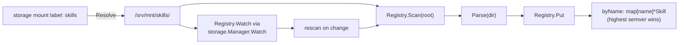
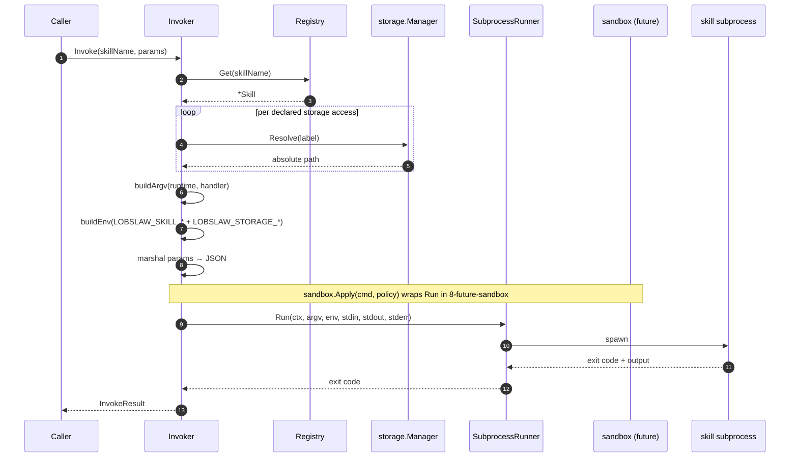
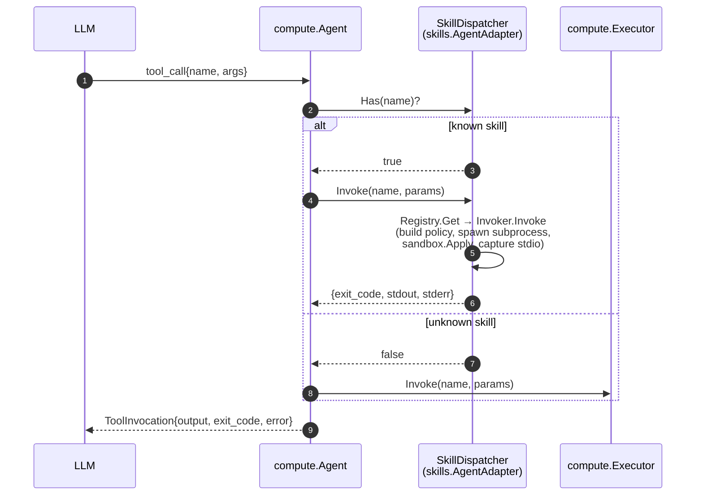

# lobslaw — Skills (Phase 8)

User-authored higher-level operations that live on a storage mount as directories of `manifest.yaml` + handler script. The skill registry watches the mount, the invoker dispatches to python or bash runtimes, and the sandbox machinery (Phase 4.5.5) gates filesystem + syscall reach via Landlock + seccomp.

Two packages cooperate:

- **`internal/skills`** — `Skill`, `Manifest`, `Registry`, `Invoker`.
- **`internal/storage`** — Phase 9's mount manager and watcher, consumed via `Registry.Watch` and `Invoker.storage.Resolve`.

Nothing in this package manages the filesystem or subprocess sandboxing directly — storage and sandbox are existing systems skills compose.

---

## Manifest shape

```yaml
# skills/agenda/manifest.yaml
name: agenda
version: 1.0.0
description: Render today's plan in a natural voice
runtime: python        # or: bash
handler: handler.py    # relative to this manifest's directory
handler_sha256: 9f86d0…  # hex SHA-256 of handler.py; required when signed
storage:
  - label: shared
    mode: read         # default; or: write
network: []            # declared allow-list (enforcement = Phase 8 future)
params_schema:
  type: object
  properties:
    window: { type: string }
```

### Validation rules

Parse rejects manifests that violate any of:

- **Name** non-empty, no `/` or `\`. Skill names are bucket keys in the registry, not filesystem paths.
- **Version** non-empty. Parsed with `golang.org/x/mod/semver`; non-semver sorts lexicographically (tolerated, but a warn shows up in the registry log).
- **Runtime** one of `python`, `bash`. Unknown runtimes reject — better than a confusing "binary not found" at invocation.
- **Handler** resolves to a file inside the manifest directory (blocks `../` traversal in operator-authored files). The file must exist — a manifest pointing at a missing handler fails Parse, not first invocation.
- **handler_sha256**, when present, must match the handler's actual contents. Checked under every signing policy including `off`: the digest is a claim the manifest makes about itself, and a mismatch is tampering regardless of whether provenance was demanded. Re-checked immediately before exec — see [Manifest signing](#manifest-signing).
- **Storage** entries: non-empty label, mode in `{read, write}` (default: read). Raw paths are never accepted — operators wire a storage mount first.

---

## Registry

`internal/skills.Registry` is name-indexed. Multiple storage mounts can expose the same skill name (e.g. `agenda` shipped by the operator's config alongside `agenda` from a plugin bundle); the registry resolves via semver-highest-wins with deterministic lexicographic tie-break on `ManifestDir`. Two replicas with identical mounts pick the same winner.



`Registry.Watch(ctx, mgr, "skills")` subscribes to the mount via the storage watcher (recursive, `manifest.yaml`-filtered) and rescans on every relevant event. Full rescan is simpler than per-file surgery and cheap at realistic skill counts.

`Registry.Remove(manifestDir)` falls back to the next-highest candidate rather than dropping the name — taking a mount offline doesn't orphan a skill the cluster still has other copies of.

---

## Invoker

`internal/skills.Invoker` looks up a skill, composes argv + env, pipes JSON params on stdin, captures stdout + stderr into capped buffers, returns exit code + duration.



### argv by runtime

| runtime | argv |
|---|---|
| `python` | `python3 <handler-abs-path>` |
| `bash` | `bash <handler-abs-path>` |

### env conventions

The subprocess sees only what the invoker composes (not inherited `os.Environ()`):

- `LOBSLAW_SKILL_NAME` — set to the skill name so handlers can log their own identity.
- `LOBSLAW_SKILL_VERSION` — the version from the manifest.
- `LOBSLAW_STORAGE_<LABEL>` — one var per declared storage access. Label is uppercased, non-`[A-Z0-9_]` characters become `_`. Value is the resolved absolute path. Lets bash handlers do `cat "$LOBSLAW_STORAGE_SHARED/file.txt"` without re-parsing config.

### stdin

`InvokeRequest.Params` is JSON-marshalled and piped to the subprocess. Handler reads from stdin:

```python
# python
import json, sys
params = json.load(sys.stdin)
print(json.dumps({"window": params.get("window", "24h"), "reply": "ok"}))
```

```bash
# bash
params="$(cat)"
echo "{\"reply\": \"got $params\"}"
```

### stdout / stderr

- **stdout** — captured into a capped buffer (1 MB). Returned as `InvokeResult.Stdout`. Convention: handlers emit JSON; the caller decodes into whatever shape they expect.
- **stderr** — capped buffer (64 KB). Surfaced on failure for operator diagnostics.
- Non-zero exit codes are NOT errors from `Invoke`'s perspective — the integer is returned via `InvokeResult.ExitCode`. `err` is reserved for spawn failures (binary missing, permission denied).

### Timeout

`InvokeRequest.Timeout` bounds the subprocess lifetime. Zero → `InvokerConfig.DefaultTimeout` (30s). The timeout plumbs through the runner's context, so both the production `CmdBuilder` (uses `exec.CommandContext`) and test fakes respect it.

---

## Security model

**Access control sits in the sandbox, not the invoker.** Today's invoker pipes JSON into a subprocess under the inherited security context; the next layer — integration with `internal/sandbox` — wraps the runner in a per-invocation `sandbox.Policy` computed from the manifest:

1. **Base** — no network, no filesystem outside handler dir + the runtime interpreter's path, seccomp allowlist from `DefaultSeccompPolicy` (same as tools), namespaces (CLONE_NEWNET, CLONE_NEWUSER, etc.), NoNewPrivs.
2. **Manifest-declared storage** — each `storage: [{label, mode}]` entry resolves via `Manager.Resolve` and adds that absolute path to Landlock's `AllowedPaths` (with `ReadOnlyPaths` for `mode: read`). A skill declaring `storage: [{label: shared, mode: read}]` can `open(O_RDONLY)` anything under the resolved path and nothing else.
3. **Runtime executable** — `python3` / `bash` paths are added to the exec allowlist.
4. **Network** — declared `network: [host:port]` entries. No enforcement today; nftables or eBPF integration is a Phase 11 item.

**Raw paths are rejected in manifests.** Skill authors can't write `path: /etc/shadow` or `path: ../../secrets`. Labels only. An operator who wants a skill to read an arbitrary host path wires a `type: local` storage mount pointing there first — same Raft-replicated audit trail as every other mount.

See [SANDBOX.md](SANDBOX.md) for the sandbox internals.

**Sandbox integration (Phase 8b.2) is shipped.** `Invoker` builds a `sandbox.Policy` per invocation and passes it via `RunSpec.Policy`; the production `CmdBuilder.Run` wraps `cmd.Start` with `sandbox.Apply(cmd, policy)` so every skill subprocess runs under Landlock + seccomp + user-namespace isolation + NoNewPrivs. Test fakes receive the policy too, so "did we ask for read-only on this label?" becomes a direct assertion.

Composition rules:

| Source | Becomes |
|---|---|
| Always | `NoNewPrivs: true`, default seccomp, user + PID + IPC + UTS namespaces |
| Manifest dir | Read-only entry in `AllowedPaths` + `ReadOnlyPaths` |
| Runtime interpreter dir (e.g. `/usr/bin` for `/usr/bin/bash`) | Read-only entry |
| `/tmp` | Writable entry (scratch for bytecode caches, lockfiles, etc.) |
| Each manifest `storage` entry | `AllowedPaths` always; `ReadOnlyPaths` only when `mode: read` |

---

## Boot wiring

Scheduler and channels are the natural skill consumers. The node layer wires:

```
node.New (Raft branch)
 ├─ storage.Manager already up (Phase 9)
 ├─ skills.Registry(log)
 ├─ skills.Invoker(Registry, Storage)
 ├─ skills.AgentAdapter(Registry, Invoker)
 └─ later, inside wireCompute:
     compute.NewAgent(AgentConfig{..., Skills: adapter})
```

`Node.SkillRegistry()` exposes the registry so tests (and eventually a `skill install` CLI) can `Put` directly. Storage-mounted skills are picked up via `Registry.Watch(ctx, mgr, "skills")` — the node deliberately doesn't hard-code the mount label; operators configure a `[[storage.mounts]]` entry labelled `skills` and call `Registry.Watch` from their startup script (or future `lobslaw skill watch` subcommand).

### Agent ↔ skills wiring

The agent sees skills as if they were tools: when the LLM emits a `tool_call` whose `name` matches a registered skill, `compute.Agent.runToolCall` short-circuits the executor path and routes through `compute.SkillDispatcher` (backed by `skills.AgentAdapter`). The executor is consulted only when `Has(name)` returns false.



Budget accounting is shared: `RecordToolCall` fires for skill-routed calls too, and `RecordEgressBytes` counts `len(stdout) + len(stderr)`. A skill can't be a loophole around per-turn budgets.

Skill errors (missing storage label, sandbox install failure, invoker config error) surface as the `ToolInvocation.Error` field — same shape as executor errors, so the model sees a uniform "this call failed because X" message regardless of which path handled it.

---

## Manifest signing

Ed25519 detached signatures, operator-configurable policy. The config flag lives under `[skills]`:

```toml
[skills]
signing_policy      = "prefer"                    # off | prefer | require
trusted_publishers  = "/etc/lobslaw/publishers"   # file path
```

**Three-state policy, not a boolean.** Most community skills ship unsigned; requiring signatures would exclude them entirely, while ignoring signatures loses the safety benefit for skills that DO ship signed.

| Policy | Unsigned manifest | Signed (valid) | Signed (invalid / wrong key) |
|---|---|---|---|
| `off` | accepted, `IsSigned=false` | accepted, `IsSigned=false` (verification never runs) | accepted, `IsSigned=false` |
| `prefer` | accepted, `IsSigned=false` | accepted, `IsSigned=true`, `SignedBy=<key name>` | **rejected** (tamper signal) |
| `require` | **rejected** | accepted, `IsSigned=true` | **rejected** |

Under `prefer`, the registry's winner-selection uses IsSigned as a tiebreaker: when two candidates share a semver, the signed one wins. Higher semver still beats lower regardless — signing is only a tiebreaker, not an override.

### Publisher key format

`trusted_publishers` points at a text file:

```
# one publisher per line
lobslaw-core       Zq3N8X4rT2aQ8m4yL7e6vJh5CpR9wK1sX0fN3tB2uV4=
community-pack-a   5XbMvQ2tGh9rP3cL8kN7wA1eF6yB4sZ0uK2dJ5nT8=
```

Format is deliberately minimal — no TOML nesting, no JSON schema — because trust roots should be human-auditable at a glance. Blank lines and `#` comments are supported.

### Signing the manifest

Publishers use any ed25519 tool (`signify`, `minisign --raw`, `openssl pkeyutl`) to sign `manifest.yaml` and drop the result next to it as `manifest.yaml.sig`. Both raw-binary and base64-encoded signature files are accepted so editors and CI pipelines don't need to agree on a format.

Example with openssl:
```bash
openssl pkeyutl -sign -inkey privkey.pem -rawin -in manifest.yaml > manifest.yaml.sig
```

### What the signature actually covers

The signature is over `manifest.yaml`'s bytes and nothing else. That only
protects the handler because the manifest pins its digest — so pin it before
signing, and re-pin whenever the handler changes:

```bash
sha256sum handler.py    # paste into handler_sha256:, then sign
```

**A signed manifest without `handler_sha256` is rejected.** It would otherwise
be worse than an unsigned one: the registry prefers signed candidates and the
audit log names a signer, while the signature covers a document that merely
*names* a script. Swapping the script afterwards would leave the signature
perfectly valid.

The digest is checked twice — at parse, and again immediately before exec.
The second check exists because registration and invocation are separated by
however long the node has been up, and the registry holds a path, not
content: everything proved at load is a statement about a file that may since
have been rewritten. This does not make the window zero (the file could
change between the final hash and the `execve`), but it reduces it from hours
to microseconds and catches the realistic case — a handler edited on a
writable mount after the node started.

---

## MCP servers

[Model Context Protocol](https://modelcontextprotocol.io/) servers are third-party subprocesses that expose tool surfaces over JSON-RPC 2.0 via stdio. Lobslaw's MCP client (`internal/mcp`) consumes these exactly like it consumes locally-authored skills — tools appear in the agent's dispatch table, go through the same per-turn budget, the same hook pipeline, and the same sandbox.

### Declaring servers

Each plugin can include a `.mcp.json` at its root. Format mirrors Claude Code's so existing manifests port over verbatim:

```json
{
  "mcpServers": {
    "fs": {
      "command": "/usr/local/bin/mcp-server-filesystem",
      "args": ["--root", "/srv/shared"]
    },
    "playwright": {
      "command": "npx",
      "args": ["-y", "@playwright/mcp@latest"],
      "secret_env": {
        "ANTHROPIC_API_KEY": "env:ANTHROPIC_API_KEY"
      }
    },
    "disabled-example": {
      "command": "mcp-foo",
      "disabled": true
    }
  }
}
```

Fields:
- `command` / `args` — subprocess argv; `command` required unless `disabled=true`.
- `env` — plain KEY=value pairs.
- `secret_env` — maps env-var names to secret refs (`env:`, `file:`, `kms:`). Resolved via the same resolver LLM providers + rclone use; refs never appear in process argv or logs.
- `disabled` — honoured by the loader so operators can ship a manifest with a temporarily-off entry without removing it.

### Boot flow

At startup, `mcp.Loader.Start` walks the plugins root for `.mcp.json` files, spawns each enabled server, handshakes via `initialize`, calls `tools/list`, and catalogues the advertised tools. Same `compute.SkillDispatcher` contract the skill invoker satisfies — the agent's `runToolCall` treats MCP tools and local skills interchangeably.

Tool name collisions across servers: the first server wins; subsequent servers advertising the same tool name log a warn and are skipped. Deterministic because `DiscoverManifests` sorts by plugin directory.

### Dispatch semantics

| MCP response | What the agent sees |
|---|---|
| `IsError=false`, text content | `ExitCode=0`, stdout = joined content |
| `IsError=true`, text content | `ExitCode=1`, stderr = joined content |
| Transport / protocol failure | tool-call `Error` surfaces, same shape as an executor or skill failure |

Non-text content types (image, resource) aren't surfaced yet — deferred.

### Security posture

MCP servers run as regular subprocesses under lobslaw's control; their tool invocations are routed through the same sandbox machinery as everything else. The MCP server process itself isn't sandboxed by default (it's an operator-trusted subprocess), but the *tool calls* it serves go through the agent's normal guard pipeline.

A signed-plugin deployment (under `signing_policy = require`) should require signed MCP manifests the same way — but manifest signing for `.mcp.json` entries is a follow-up; today only skill manifests are signed.

### What's not yet shipped

- Server notifications (push updates from server → client).
- Streaming tool responses.
- Resources / prompts / sampling (only tools are consumed).
- Per-invocation sandbox for the MCP *server* process itself (trusted-subprocess model today).
- `.mcp.json` manifest signature verification.

---

## RTK integration

RTK (Rust Token Killer) compresses tool output and decorates prompts to cut token cost on routine dev operations. Because it already speaks the Claude-Code hook protocol (JSON request on stdin, JSON response on stdout) and lobslaw adopted that same protocol in `internal/hooks`, no RTK-specific Go code is needed — it's a pure-config integration.

Drop the entries from `examples/hooks.rtk.toml` into your `config.toml` and restart the node. RTK fires on every `PreToolUse` / `PostToolUse` event, runs outside the tool's sandbox (it's a hook, not a tool), and returns its decision in the usual hook response shape.

Short timeouts are intentional: a stuck RTK shouldn't block tool dispatch. The hooks dispatcher treats a timed-out hook as approve-through so a mis-installed RTK can't wedge the agent.

---

## What's shipped vs deferred

| Item | Status |
|---|---|
| Manifest parsing + validation | ✅ shipped |
| Registry (winner selection, fallback, scan, watch) | ✅ shipped |
| Invoker (python/bash, JSON stdin, capped stdio, timeout) | ✅ shipped |
| Storage-label env vars | ✅ shipped |
| **Sandbox integration** (Landlock/seccomp/ns per manifest) | ✅ shipped (8b.2) |
| **Agent integration** (skills as tool-registry entries) | ✅ shipped (8c) |
| **RTK hooks example** (config-only, uses existing hooks system) | ✅ shipped (8f) |
| **Signature verification** (tri-state policy + ed25519) | ✅ shipped (8g) |
| **Skill policy.d/ loading** (sandbox.LoadSkillPolicies wired into Scan) | ✅ shipped |
| **memory:dream scheduler handler** (scheduler trigger for the Dream/REM pass) | ✅ shipped |
| **Plugin install CLI** (`lobslaw plugin install/enable/disable/list/import`) | ✅ shipped (8d) |
| **MCP client** (stdio JSON-RPC subprocess, tool surfacing) | ✅ shipped (8e) |
| **RTK hooks** (config-only PreToolUse/PostToolUse integration) | ⬜ Phase 8f |
| **Signature verification** (minisign / SHA-pinning) | ⬜ Phase 8g |
| Go runtime, WASM runtime | ⬜ roadmap |

---

## Progressive disclosure

The skill index is level 0: **every** installed skill, by name and one
line, in the system prompt on every turn. Bodies are fetched on demand.

| Level | What | Cost |
|---|---|---|
| 0 | name + one-line description + named references | bounded, O(skills) |
| 1 | the skill body | on demand *(not yet built)* |
| 2 | a bundled reference file | on demand *(not yet built)* |

**The index is complete, and says so.** Ranking and showing the top few
is the obvious optimisation and it is the wrong one: a retrieval miss
makes a capability invisible and the model then confabulates about what
it has — precisely the failure that killed keyword tailoring here
before. Ranking better is not the same as not hiding things.

### Description limit

`MaxDescriptionChars` (160 runes, single line) is enforced at **parse**,
not at render. Truncating when the index is built means an operator
writes a 200-character description, sees it accepted, and silently
loses most of it. The error belongs where it can be fixed, naming the
manifest. Counted in runes, so a non-Latin description gets the limit
that is documented.

### Conditional activation

The one thing safely dropped from the index is a skill that could not
run here at all. Advertising it teaches the model it has a capability
it will then fail to use, which is worse than silence.

```yaml
platforms: [darwin]              # GOOS allowlist; empty means anywhere
requires_capability: [vision]    # provider capabilities the skill needs
requires_binary: [ffmpeg]        # host binaries that must resolve
references:                      # named in the index, never inlined
  - references/api.md
```

Every requirement must hold. A skill dropped for any of them is logged
**once** with the reason — an operator asking "where did my skill go"
needs an answer, and a skill vanishing silently is indistinguishable
from one that failed to parse.

The binary check fails **open** when the node cannot answer it: the
invoker checks again before exec, so the cost of being wrong is one
clear error rather than a capability that quietly disappeared.

### The index was empty

`promptgen.GenerateInput.Skills` existed and `BuildSkills` rendered it,
and nothing ever populated it — so "Installed Skills" said "(none
installed)" on every turn no matter what was installed. A skill could
only be invoked by a model that guessed its name. `AgentConfig.SkillsProvider`
is what fills it.

